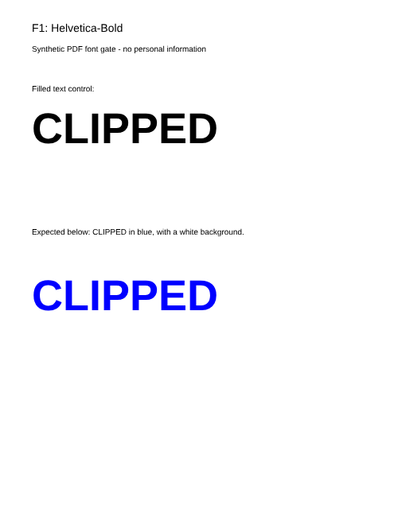

# M2B: reviewed OFL font alternative

Date: 2026-09-27. **Bounded compatibility gate passed; M2B implementation continues.**

The [official latest release](https://github.com/liberationfonts/liberation-fonts/releases/tag/2.1.5) is Liberation Fonts 2.1.5. The release's linked TTF archive SHA-256 is `7191c669bf38899f73a2094ed00f7b800553364f90e2637010a69c0e268f25d0`. Its [license](https://github.com/liberationfonts/liberation-fonts/blob/2.1.5/LICENSE) and the four font name tables identify SIL OFL 1.1, Google (2010) and Red Hat (2012) copyright notices. All four fonts report Version 2.1.5 and family Liberation Sans. The original Regular, Bold, Italic and BoldItalic files and LICENSE are retained byte-for-byte, with [exact provenance/hashes/metadata](../../packages/pdf-browser/assets/liberation-sans/2.1.5/provenance.json). No unrelated family, font renaming, modification or CDN is involved.

## Configuration and findings

PDF.js 6.3.289, `useSystemFonts:false`, `disableFontFace:true`, explicit owned worker, first-party assets, `enableXfa:false`, no scripting/viewer/interactive annotation layer. The supported glyph-path option avoids Firefox native-font diagnostics; its throughput remains subject to the M2B benchmarks. The native FontFace configuration was evaluated first and emitted Firefox glyph-validation warnings despite visibly correct clipping. It was not accepted by the strict diagnostic check.

| Browser (Windows Playwright) | Documents/pages | Original clipping fixed | Four styles/spacing | Geometry | Unexpected requests/diagnostics |
| ---------------------------- | --------------- | ----------------------- | ------------------- | -------- | ------------------------------- |
| Chromium 153.0.8010.12       | 4 / 12          | Yes                     | Passed              | Expected | 0 / 0                           |
| Firefox 155.0                | 4 / 12          | Yes                     | Passed              | Expected | 0 / 0                           |
| WebKit 26.6                  | 4 / 12          | Yes                     | Passed              | Expected | 0 / 0                           |

The exact prior `font-clipping.pdf` was reused unchanged: Helvetica Bold, Times and embedded Noto controls now all produce the expected blue letter shapes. `font-variants.pdf` adds regular/bold/italic/bold-italic black text with metric guides, separate fixed lines, and blue clipping. `preview-features.pdf` covers embedded Latin/Greek/Cyrillic, standard/nonembedded Helvetica/Arial/Times/Courier/Symbol, crop origin and rotation, plus an inert link. Existing `form.pdf` retains its static field appearance.

All normal pages remained 500 × 650; the cropped, rotated page remained 560 × 420. Independent Poppler references show matching text visibility, line placement, style and clipping. There is no visible wrapping/overlap regression in these fixed-layout samples. Pixel bounds and tolerance comparisons are evidence, not a universal pixel-equality or all-fonts guarantee. Poppler's environment emits Symbol/ArialUnicode discovery warnings, as recorded in the initial gate report. No physical device testing is claimed.

Before (permitted subset without Sans font programs):

After (unmodified OFL Sans 2.1.5):

Reference:

[Browser results](M2B-ofl-font-results.json) and [style reference comparison](M2B-ofl-reference-comparison.json) retain numeric/asset evidence without extracted document text. PDFs were selected locally; every recorded request was a same-origin GET. All fonts were requested from the loopback application origin. There were no failed requests or console events in the selected configuration.

Reproduce with `pnpm install --frozen-lockfile`, the existing Playwright browser installation, `node scripts/prepare-pdfjs-assets.mjs`, and `node scripts/check-pdfjs-font-gate.mjs --ofl`. The default invocation still reproduces the earlier excluded-font experiment by denying all Liberation requests. Source fonts are vendored in their original form so normal builds require no font download. Production packaging/unrelated-route tests and complete foundation verification follow as part of M2B; this experiment itself is not a product route.
