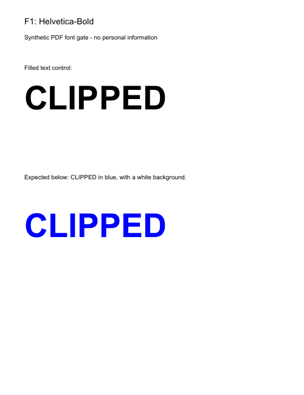
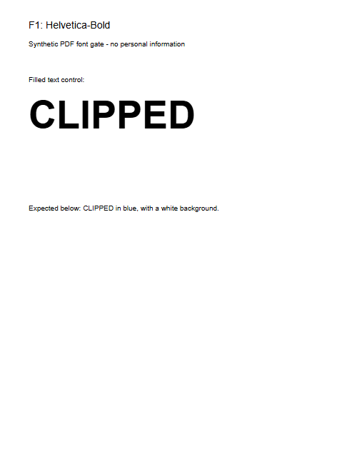

# M2B COMPLETION REPORT — PDF Preview & Page-Operation Foundation

**Historical gate, now resolved:** the owner authorized an alternative-font spike and unmodified official Liberation Sans 2.1.5 passed. See [alternative evidence](../benchmarks/M2B-ofl-fonts.md) and [ADR-013](../adr/013-m2b-page-foundation.md). The original failure report below is retained for provenance.

Date: 2026-09-27

**Historical status at the time of this gate: NOT COMPLETE — stopped at Amendment 1's font licensing/fidelity gate.**

The current M2B instruction explicitly requires stopping if the font gate cannot be resolved safely. `AGENTS.md` also reserves material licensing/architecture decisions for the owner. The experiment below found visibly missing content with the permitted subset. No workaround, replacement font, weakened check, or acceptance of that degradation has been introduced.

## Work completed before the gate

- Inspected the approved scope, documentation, ADR-010/011/012 and merged M2A baseline.
- Created local feature branch `feat/m2b-pdf-foundation` from `ef1ce33eafa134e9646d52e640c285ec9de9c987`.
- Pinned `pdfjs-dist@6.3.289`; excluded only its optional Node canvas dependency through a version/package-specific override. Existing install-script policy and dependency versions remain unchanged.
- Added an explicit asset-copy allowlist and an isolated, manually invoked browser experiment. Neither is wired into normal app startup/builds. The experiment binds to loopback, serves no PDF files, opens synthetic files through browser file selection, uses one explicit native PDF.js worker per document, and has no Next.js/product route.
- Added small synthetic font/crop/rotation/link and text-clipping fixtures, authoring scripts, independent manifests and the embedded font's OFL notice. M2A fixtures are unchanged.
- Recorded exact asset hashes, browser evidence, and two deliberately retained synthetic reference/actual images for review.

Material files: `packages/pdf-browser/package.json`, `pnpm-lock.yaml`, `pnpm-workspace.yaml`, `.gitignore`, `scripts/prepare-pdfjs-assets.mjs`, `scripts/check-pdfjs-font-gate.mjs`, `tests/fixtures/generate_preview.py`, `tests/fixtures/generate_font_gate.py`, their PDFs/manifests/license notice, `docs/dependency-review.md`, and `docs/benchmarks/M2B-font-*`.

## Dependency and asset decision

The installed runtime is Apache-2.0. See the [complete relevant experiment inventory](../benchmarks/M2B-font-assets.json) for names, bytes, SHA-256 hashes and notice mappings.

| Permitted experiment group | Files including group notices | License texts inspected                                              |
| -------------------------- | ----------------------------: | -------------------------------------------------------------------- |
| Runtime API + worker       |           2, plus root notice | Apache-2.0                                                           |
| CMaps                      |                           169 | Adobe BSD-style                                                      |
| Foxit standard fonts       |            10 PFBs + 1 notice | PDFium BSD-3-Clause                                                  |
| Image/color codec assets   |          5 assets + 6 notices | BSD-3-Clause/Apache-2.0 (JBIG2), BSD-2-Clause (OpenJPEG), MIT (qcms) |
| ICC profile                |          1 profile + 1 notice | CC0-1.0                                                              |

The copy script prepares **193 group files**, plus root `LICENSE` and a generated manifest. It copies no Liberation files. These generated assets are ignored by Git. The runtime/worker are served directly from the pinned package only during the local experiment.

Excluded font assets: `LiberationSans-Regular.ttf`, `LiberationSans-Bold.ttf`, `LiberationSans-Italic.ttf`, `LiberationSans-BoldItalic.ttf`, and `LICENSE_LIBERATION`. The installed notice identifies GPLv2 with specified font exceptions. No distribution authorization is inferred from the top-level Apache license or from the exception concerning embedding fonts in documents.

Viewer, sandbox, legacy, QuickJS, separate image-decoder bundles, source maps and other non-allowlisted files are excluded. The inventory describes this experiment, not a completed production bundle/compliance review. The package remains intact in `node_modules`; excluded fonts were never copied into the served directory or served in the test.

## Font experiment and fidelity evidence

Tested Windows browsers: Chromium **153.0.8010.12**, Firefox **155.0**, WebKit **26.6**, using existing Playwright **1.63.0**. Each ran three fixtures with `useSystemFonts: true` and `false`: **18 document loads / 48 rendered pages**. Render promises resolved, demonstrating why successful rendering alone is insufficient.

Initial visual samples cover an embedded Noto Sans subset (Latin, Greek, Cyrillic), nonembedded Helvetica/Times/Courier/Symbol/Arial, a nonzero crop origin, original 90-degree rotation and a static AcroForm appearance. Ordinary filled text is legible in the inspected samples. This is not a claim of complete non-Latin coverage. WebKit's default system-font path requests the excluded Liberation Bold file even on ordinary text; those requests receive 404s. A 404 alone is not the reason for stopping.

The additional fixture uses standard PDF text rendering mode 7: text defines a clipping shape, followed by a blue rectangle. The correct result is blue letters on white. It compares nonembedded Helvetica Bold, nonembedded Times Roman and embedded Noto Sans in the same document. Its manifest specifies the expected visual result independently of PDF.js.

| Browser  | System fonts | Helvetica clipping     | Times clipping | Embedded clipping |
| -------- | ------------ | ---------------------- | -------------- | ----------------- |
| Chromium | true         | Missing: 0 blue pixels | Missing: 0     | Present: 2,307    |
| Firefox  | true         | Missing: 0             | Missing: 0     | Present: 2,307    |
| WebKit   | true         | Missing: 0             | Missing: 0     | Present: 2,307    |
| Chromium | false        | Missing: 0             | Present: 2,271 | Present: 2,307    |
| Firefox  | false        | Missing: 0             | Present: 2,279 | Present: 2,307    |
| WebKit   | false        | Missing: 0             | Present: 2,271 | Present: 2,307    |

Visual inspection confirms the missing letters, rather than merely a changed font or anti-aliasing difference. Poppler independently renders the Helvetica letters. With system fonts disabled, PDF.js loads the permitted Foxit Serif font and correctly clips Times, but requests the excluded Liberation Regular/Bold assets and still omits Helvetica clipping. The embedded control works in both configurations.

Expected independent reference:



PDF.js with the permitted subset and system fonts disabled:



The installed PDF.js code supports this diagnosis: `getFontNameToFileMap` maps Helvetica variants to Liberation assets; `fetchStandardFontData` skips most font-program loading when system fonts are enabled; canvas glyph-path generation is conditional on a font program being available. This is a valid standard-font PDF feature. Its prevalence in users' documents has not been measured. The experiment does not establish that all ordinary body text fails, nor that shipping Liberation is already proven to solve every preview issue. **The excluded-font configuration has not been tested or served.**

Raw safe evidence: [browser results](../benchmarks/M2B-font-gate-results.json). `clippingCorrect: null` means a fixture is outside the clipping assertion; it does not mean all of its visual behavior has been automatically verified.

## Reproduction and checks

From the repository root, with the README's Node/pnpm setup:

```powershell
pnpm install --frozen-lockfile
pnpm --filter @document-platform/web exec playwright install chromium firefox webkit
node scripts/prepare-pdfjs-assets.mjs
node scripts/check-pdfjs-font-gate.mjs
```

The last command **intentionally exits 1 on the observed missing clipping** and saves screenshots plus safe structured results under ignored `.tools/m2b-font-gate/`. It never extracts/logs document text. Do not reinterpret this failure as a passing M2B gate. Fixture authoring is optional; the small PDFs stored in `tests/fixtures/pdf` are sufficient to rerun the experiment. Authoring requires the existing ReportLab/pypdf environment and the pinned font specified in `preview-manifest.json`.

Independent checks: pypdf verified both fixture hashes and page counts (4 and 3), and inspected the embedded/nonembedded font resources. Poppler rendered reference images at 72 dpi. Its environment emitted font-discovery warnings for Symbol/ArialUnicode; the Helvetica/Times/embedded clipping references were visually inspected. This is independent renderer evidence, not a completed manual PDF-reader acceptance review.

Locked dependency installation passed. `pnpm audit --json` passed with zero known vulnerabilities at every severity. Existing unit regressions passed: **17 PDF engine/worker tests + 34 web tests (51 total)**. Formatting checks for the changed text files, Node syntax checks for both scripts, and `git diff --check` passed.

## Privacy and lifecycle scope

All recorded experiment requests were same-origin GETs for the experiment page/runtime/assets. There were zero non-GET or cross-origin requests. PDFs entered through local file selection; no document bytes, filenames, extracted text, pixels or metadata were uploaded. The synthetic link remained inert. Recorded diagnostics contain only event types, known asset paths and synthetic fixture measurements.

Every experiment document's renders completed before its loading task was destroyed, PDFWorker destroyed and owned native worker terminated. Browser contexts and the loopback server were closed. This does not substitute for the required production cancellation/replacement/unmount tests and is not a claim of secure browser-memory erasure.

## Work deliberately not reached

The stable page model, pdf-lib structural operations/validation, structural worker, preview adapter/scheduler/cache, PageThumbnail/ReorderControls and test-only Next consumer have **not been implemented**. Their approved design remains pending this gate. No M3 tool route/workflow has been introduced; Merge application code and registry availability are unchanged.

Concurrency/cache/mobile benchmarks, production lifecycle tests, accessibility review, mobile visual review, expanded hosted CI, unrelated-route runtime-network assertions, transformed-output verification and full M0/M1/M2A/processor/container regression were not completed for M2B. No such result is claimed. Existing CI/protection/check settings were not changed or weakened. No physical-mobile evidence is available.

## Owner/architecture decision needed

**May M2B serve the four exact bundled LiberationSans TTF files from PDF.js 6.3.289 under their shipped GPLv2 terms and exceptions, after the owner approves the applicable licensing/compliance obligations, so their fidelity can be evaluated?** If that distribution posture is unacceptable, an explicitly approved alternative font/rendering architecture is needed.

There is no unilateral choice to distribute those fonts, substitute unrelated files, or accept the demonstrated missing content. Allowing the bundled fonts would permit further testing; it would not itself establish that the preview foundation is complete.

## Repository/delivery status and next step

Branch: `feat/m2b-pdf-foundation`. HEAD remains the M2A baseline `ef1ce33eafa134e9646d52e640c285ec9de9c987`. Gate work is local and uncommitted; the working tree is intentionally dirty. No M2B commit, push, PR, hosted run or merge has been made. The early-stop instruction took effect before normal implementation delivery.

Recommended next step: resolve the font licensing/fidelity gate, then resume the approved M2B foundation. M2B is not complete; M3 planning/implementation should not begin.
